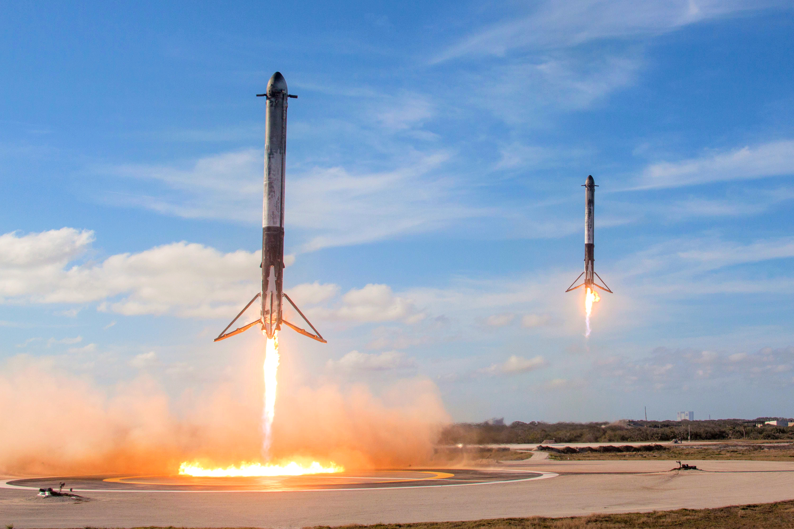
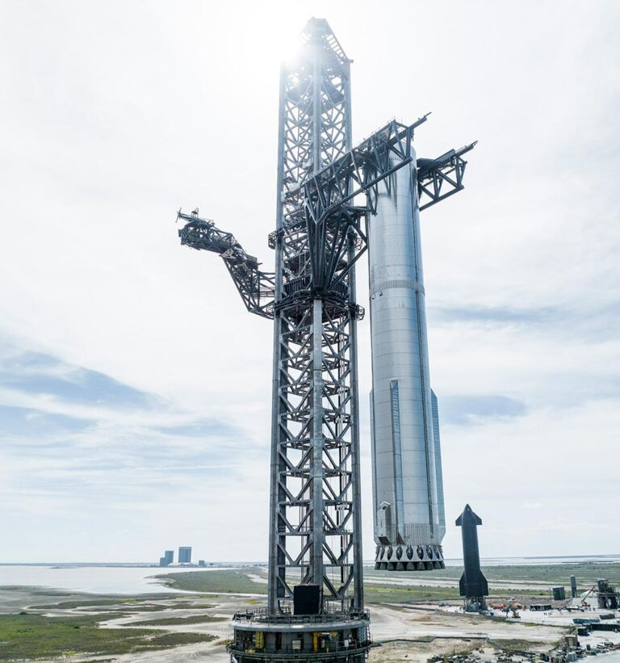
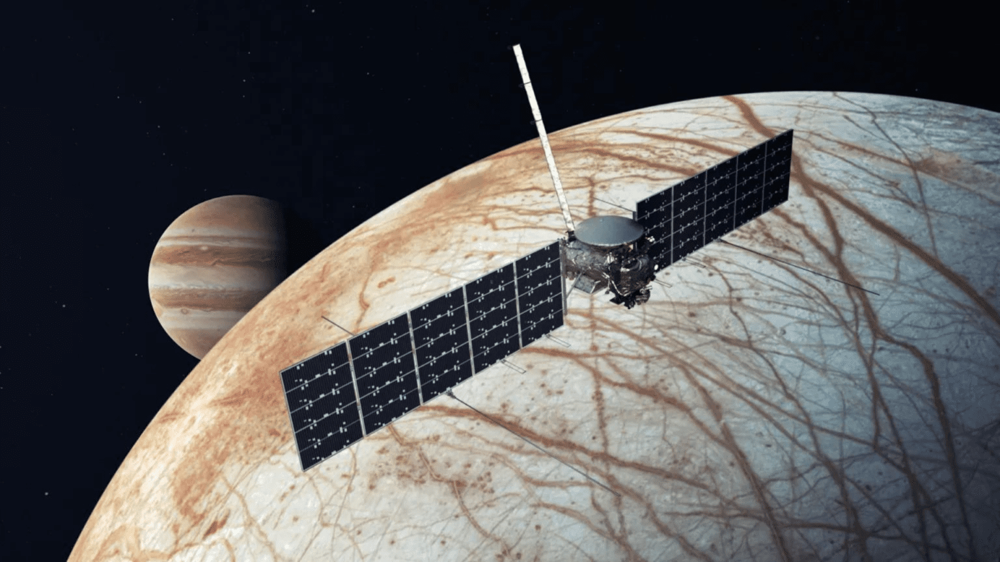
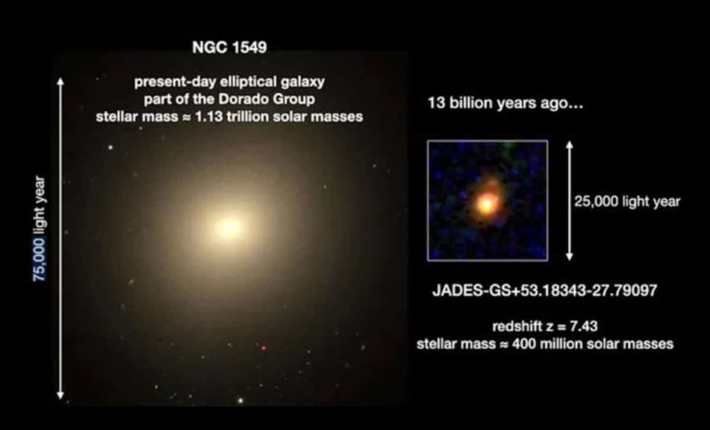
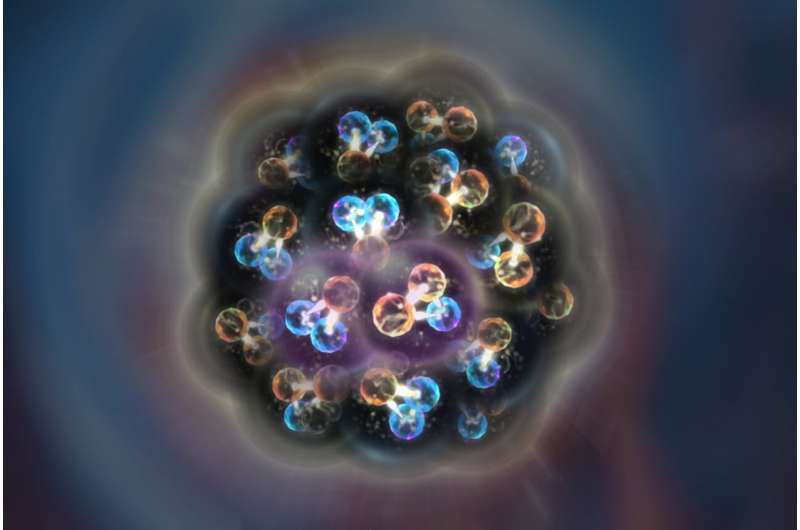
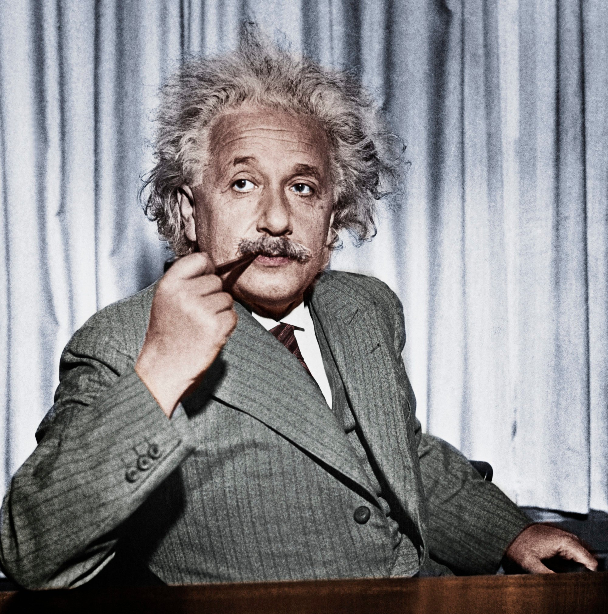

## კვირის სიახლეები

### SpaceX წარმატებული მეხუთე სატესტო ფრენა

SpaceX მსოფლიოში ყველა დიდი სტარტაპია რომელიც მიზნად მარსის კოლონიზაციას ისახავს. SpaceX-ის მთავარი სტრატეგია ამ მიზნის მისაღწევად, კოსმოური ხომალდების დამზადებისა და გაფრენის ფასების შემცირებაა, რასაც მრავალგამოყენებადი ხომალდების ტექნოლოგიების განვითარებით ახერხებს.
SpaceX-ის Falcon 9 პირველი ორბიტული ხომალდია, რომელსაც რამდენჯერმე შეუძლია გაფრენა. Falcon 9-ის 400-მდე გაფრენიდან, 300-ზე მეტჯერ წარმატებით დაბრუნდა დედამიწაზე და მისი გამოყენება სხვა მისიებშიც მოხერხდა.

SpaceX-მა შექმნა მსოფლიოში ყველაზე მაღალი და მძრავლი კოსმოსური ხომალდი Starship, რომელიც მთვარეზე და მარსის მისიებისთვის უნდა იყოს გამოყენებული და მისი მრავალგამოყენებადობა ძალიან მნიშვნელოვანია ხარჯების კუთხით. Starship-მა უკვე გაიარა 5 სატესტო ფრენა და ემზადება 2025 წელს მთვარის სამხრეთ პოლუსზე გასამგზავრებლად NASA-ს მისიის ფარგლებში. Starship-ის მეხუთე სატესტო ფრენა იმით იყო გამორჩეული, რომ
SpaceX-ის გუნდმა მოახერხა და 71 მეტრი სიმაღლის, 4000 ტონიანი Super Heavy ბუსტერი ხომალდი წარმატებით დაიჭირა სპეციალური კოშკის მექაზილას "ჩხირებით".

### NASA Europa Clipper მისია

NASA-მ 14 ოქტომბერს, SpaceX-ის Falcon Heavy ხომალდის მეშვეობით გაუშვა მისია იუპიტერის მთვარე ევროპის შესასწავლად. არსებობს მეცნიერული მტკიცებულება რომ ევროპას ყველა ინგრედიენტი აქვს სიცოცხლის არსებობისთვის და ამ მისის ფარგლებში NASA-ს სურს რომ დაამტკიცოს სიცოცხლისთვის აუცილებელი პირობების არსებობა და/ან აღმოაჩინოს სიცოცხლე.

ხომალდი 3 მილიარადემდე კილომეტრს გაივლის და იუპიტერს 2030 წლისთვის მიაღწევს. ის იუპიტერის ორბიტაზე იფრენს და ევროპას 49-ჯერ ჩაუფრენს ახლო დაკვირვებებისთვის.

### "შებრუნებული" გალაქტიკები ადრეულ გალაქტიკაში

ასტრონომებმა ჯეიმს ვების კოსმოსური ტელესკოპის დახმარებით აღმოაჩინეს გალაქტიკა რომელიც "შებრუნებული" იზრდებოდა. ეს მოვლენა დიდი აფეთქებიდან სულ რაღაც 700 მილიონი წლის შემდეგ ფიქსირდება და ეს გალაქტიკა ირმის ნახტომზე 100-ჯერ პატარაა, მაგრამ გალაქტიკა გასაკვირად ჩამოყალიბებულია ადრეული სამყაროსთვის და მისი სტრუქტურა თანამედროვე გალაქტიკებისას გავს რომელბსაც 1000-ჯერ მეტი ვარსკლავლები ყავთ.
ნორმალურ გალაქტიკებში ვარსკლვალვები კონცეტრირებულია ბირთვში, და სიმჭირდროვე მცირდება გალაქტიკის გარე უბნებში, ხოლო შებრუნებულ გალაქტიკებში პირიქითაა, გარე უბნებში არის კონცეტრირებული ვარსკლავების უმეტესობა და ბირთვისკენ მცირდება მათი რაოდენობა.

### კვარკებისა და გლუონებისგან შექმნილი ატომბირთვის პირველი თანმიმდევრული სურათი

ატომბირთვი შედგება პროტონებისგან და ნეიტრონებისგან, რომლებიც შესაბამისად შედგებიან კვარკებისა და გლუენებისგან. მიუხედავად იმისა რომ მეცნიერებმა ეს 1960-იანი წლებიდან იციან, მათ დღემდე არ შეეძლოთ ატომბირთვის ყველა თვისების აღწერა კვარებითა და გლუონებით. ჟურნალ Physical Review Letters-ში ახლად გამოქვეყენებულმა ფურცელმა, nCTEQ-ისა და პოლონეთის მეცნიერების აკადამიის ბირთვული ფიზიკის ინსტიტუტის კოლაბორაციით, შეძლო ატომბრითვის აღწერა კვარებითა და გლუონებით.

## სიცოცხლე იუპიტერის მთვარეზე

თემის მიმოხილვა სიცოცხლის შესაძლო არსებობაზე იუპუტიერის მთვარე ევროპაზე. Lorem ipsum odor amet, consectetuer adipiscing elit. Montes platea senectus nostra amet nunc elementum purus iaculis. Nulla nulla dapibus mi aliquet sodales aptent convallis. Auctor pulvinar tortor consectetur; aenean maecenas porta ac erat. Neque natoque cursus sagittis enim bibendum nullam. Ipsum euismod sit nibh ac vivamus; magnis sem a. Aptent diam condimentum pellentesque fringilla maximus feugiat torquent viverra turpis.

Fusce vestibulum rhoncus diam, ex maximus ligula. Semper faucibus purus lectus diam dolor pulvinar. Sit pulvinar egestas fusce dapibus egestas himenaeos. Ligula vivamus varius dolor tincidunt; et inceptos ad ipsum. Molestie eleifend ridiculus sollicitudin cursus primis sociosqu commodo vulputate. Ridiculus vel proin rutrum elit eget dis morbi eget ultrices. Enim nisi fusce cubilia tortor faucibus facilisis fusce augue.

Platea mi ornare consectetur dictum, mus convallis integer. Eget ac inceptos auctor eu commodo metus nam. Sodales montes hac adipiscing pulvinar parturient laoreet ultricies felis. Enim mollis odio mattis dapibus ullamcorper nunc fames sagittis. Eleifend laoreet odio aliquet a eros accumsan vulputate? Mollis enim dictumst primis, tincidunt mi platea ac dictum. Elementum tristique praesent ac feugiat enim elementum. Egestas congue eget maximus suspendisse vitae elementum cursus hac rutrum.

Blandit consequat amet hac rhoncus rhoncus faucibus elementum. Natoque bibendum iaculis fusce sodales id. Sollicitudin odio mi congue accumsan odio nunc. Sed finibus amet nunc at duis. Ornare litora cubilia malesuada fames; dictumst dis potenti. Hac sodales vehicula nostra porta purus pretium tempus ultricies bibendum. Faucibus parturient fusce consequat dictum montes id posuere nullam. Sociosqu dolor dolor ultricies facilisis facilisi facilisis tincidunt nisl dolor. Adipiscing pretium convallis convallis potenti, lobortis quis. Volutpat consequat phasellus habitasse; platea phasellus massa placerat hac quam.

## კვირის საინტერესო ფაქტი

სამყაროს 5% შედგება ჩვენთვის ცნობილი და ხილული ნორმალური მატერიისგან, ხოლო დანარჩენი 95% ჩვენთვის უცნობია. 27% ბნელი მატერიისგან შედგება, ხოლო 68% ბნელი ენერგიაა. სამყაროში არსებული მასის 85% ბნელი მატერიისაა, ხოლო არსებული ენერგიის 95% ბნელი ენერგისაა.

ბნელი მატერია, ნორმალურ მატერიასთან ინტერაქციაში არ შედის, გარდა გრავიტაციისა რაც ლაბორატორიულ დაკვირვებებს ართულებს. ბნელი მატერია ძირითადად კონცეტრირებულია გალაქტიკებში და მათ ირგვლივ, და შესაძლოა წვლილს იღებდნეს შავი ხვრელების ჩამოყალიბებაში.

ბნელი ენერგია, ენერგის ფორმაა რომელიც სამყაროს უდიდეს სტრუქტურებზე ახდენს გავლენას და შესაძლო მიზეზია სამყაროს გაფართოების და გაფართოების აჩქარების. ბნელის ენერგიის არსებობა გამყარებულია უამრავი მტკიცებულებით და პირდაპირი დაკვირვებიბით თუმცა მათი ზუსტი ბუნება ჩვენთვის უცნობია.

## კვირის მეცნიერი: ალბერტ აინშტაინი

ალბერტ აინშტაინი მე-19 და მე-20 საუკუნეში მოღვაწე გერმანელი ფიზიკოსია. მას ეკუთვნის ცნობილი E = MC^2 ფორმულა, ფართობითობის თეორიები რომლებმაც საფუძვლიანად შეცვალა წარმოდგები დროსა და სივრცეზე, გრავიტაციის ექვივალენტობის პრინციპი და სხვა მრავალი აღმოჩენა. მას მოგებული აქვს 1921 წლის ნობელის პრემია ფიზიკაში და ათამდე ნობელის პრემია გაცემულია მის შრომებზე დაყრდნობით. აინშტაინი ასევე დასახელდა 20-ე საუკუნის ადამიანად (Person of the Century).

## ასტრონომიის ისტორია

Lorem ipsum odor amet, consectetuer adipiscing elit. Inceptos ullamcorper commodo taciti est nibh odio varius ultrices. Rutrum enim orci natoque tortor, proin ante potenti aliquam. Dui arcu at ac dis fringilla ut varius orci. Leo praesent libero neque faucibus nam at. Semper montes aliquet vestibulum tempus aenean odio lectus a conubia. Vestibulum potenti ornare ultricies elementum maecenas netus lectus aliquet. Sociosqu purus mollis quis ligula laoreet conubia. Per justo a proin potenti malesuada.

Faucibus bibendum leo elementum a, arcu convallis cubilia. Non facilisi ipsum ante imperdiet mi. Nisi etiam ligula luctus nec nec at morbi. Diam conubia sollicitudin arcu hendrerit netus mauris ad leo. Morbi class felis maximus torquent blandit lobortis dictum imperdiet ullamcorper! Pellentesque inceptos donec quisque consequat elit fames. Lectus aenean lectus sed eu morbi ante varius ad curae. Aliquet iaculis lectus ridiculus nunc inceptos dapibus; ad eros. Velit luctus velit placerat; nunc enim class nullam. Metus nam tristique ipsum volutpat congue parturient.

## Q&A

შეკითხვებისთვის დასასვამად მოგვწერეთ მაილზე: []

## კვირის ფოტო

კვირის ფოტოების არჩევა მოხდება Facebook ჯგუფიდან